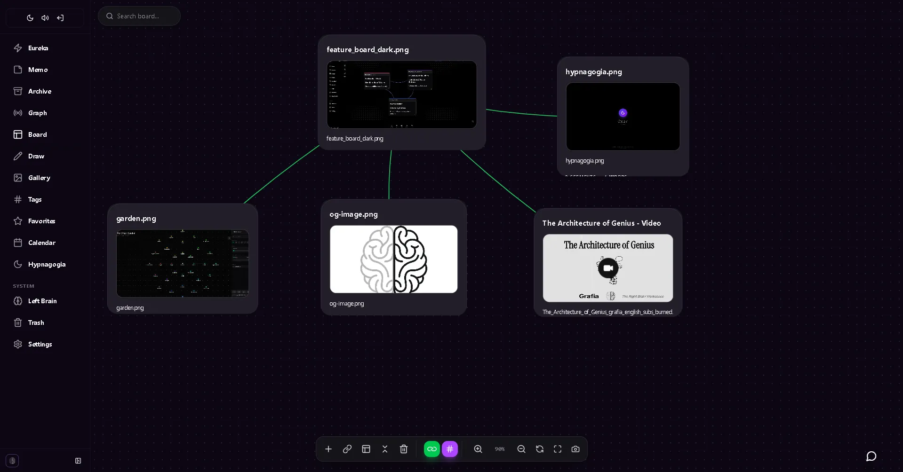

  

  

    A local-first creative workspace. Capture ideas in any format, connect them, and generate images, music, and video with AI — all from your notes.
  

 

## Downloads

- **Web:** [grafia.garden](https://grafia.garden)
- **Android:** [**Download on Google Play**](https://play.google.com/store/apps/details?id=garden.grafia.app)
- **Windows:** [**Download Grafia 1.1.5 (x64)**](https://github.com/grafia-app/grafia-releases/releases/download/v1.1.5/Grafia_1.1.5_x64-setup.exe)
- **Linux / macOS / iOS:** Coming Soon

> **Grafia Local** — optional offline AI engine (run models on your own machine): [**Download 1.0.0 (Windows x64)**](https://github.com/grafia-app/grafia-releases/releases/download/local-v1.0.0/Grafia.Local_1.0.0_x64-setup.exe) · [guide](https://grafia.garden/local).

> **Grafia Piano** — desktop piano studio: [**Download 1.0.0 (Windows x64)**](https://github.com/grafia-app/grafia-releases/releases/download/piano-v1.0.0/Grafia_Piano_1.0.0_x64-setup.exe).

---

## Capture

  

 

- **Text** — Markdown + block editor. Write without friction.
- **Audio** — Record in Opus. Transcribe with Whisper, 100% offline.
- **Image & Video** — Visual notes for your creative process.
- **Canvas** — Infinite drawing surface for ideas that don't fit in words.
- **Hypnagogia** — True-black OLED mode to capture ideas between wakefulness and sleep.

---

## Connect

  

 

- **Knowledge Graph** — See connections between your ideas you didn't know existed.
- **AI Chat** — Ask questions about your own notes. Find hidden patterns.
- **Semantic Search** — Find "that idea about architecture" even if you never wrote that word.
- **The Incubator** — Spaced repetition resurfaces drafts at the right moment.

---

## Create

  

 

- **AI Image Generation** — 10+ models. Create, reference, and edit from your notes.
- **AI Music** — Generate original tracks from a text prompt.
- **AI Video** — Text-to-video, image-to-video, reference, extend. 30+ models.
- **Creative Assistant** — AI chat with context from multiple notes on your board.
- **Bring Your Own Key** — Use Gemini, OpenAI, Grok, MiniMax, DashScope, or any OpenAI-compatible API.

---

## Privacy & Offline

Your data stays on your device. Works offline. Sync is optional and encrypted. AI keys are stored locally with AES-256 encryption — never sent to our servers.

## What is this repository?

This is a **distribution-only** repository. It hosts the installable files (releases) of **Grafia**.

The source code is private. If you want to report a bug or suggest an improvement, please visit [grafia.garden](https://grafia.garden) or open an [Issue](https://github.com/grafia-app/grafia-releases/issues).

   
  
Built with care by <a href="https://grafia.garden">Grafia</a>

