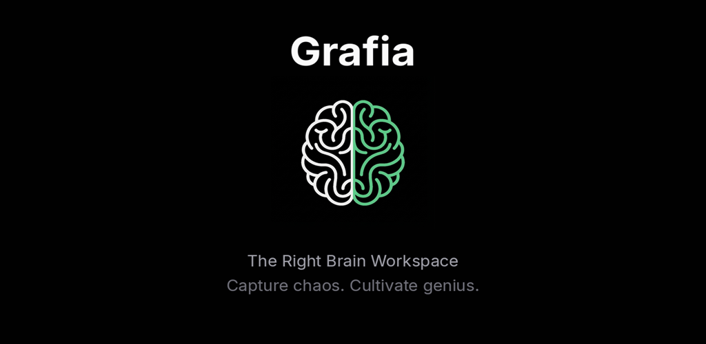
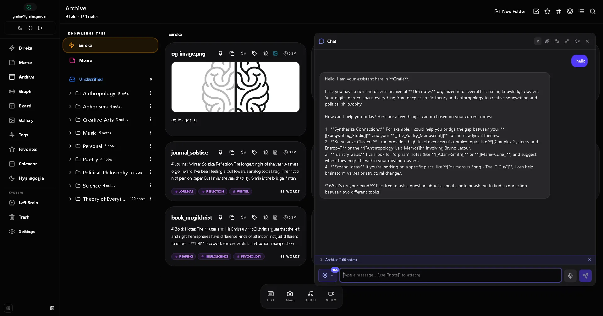
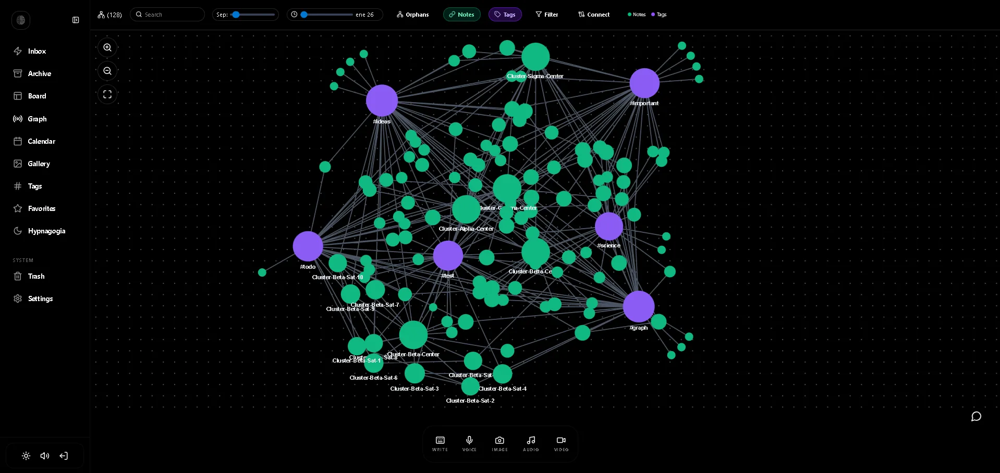

  

  

    A creative idea capture app, fast and local-first. Designed to manage a multipotential mind and help your creative process.
  

 

## Downloads

- **Web:** [grafia.garden](https://grafia.garden)
- **Android:** Available on **Google Play** _(Coming Soon)_
- **Windows / Linux:** Coming Soon
- **macOS / iOS:** Coming Soon

---

## Screenshots

  
    
  

---

## What is this repository?

This is a **distribution-only** repository. It is used exclusively to host and distribute the installable files (releases) of **Grafia**.

The source code is private. If you are a user and want to report a bug or suggest an improvement, please contact us through [grafia.garden](https://grafia.garden) or open an [Issue](https://github.com/grafia-app/grafia-releases/issues).

   
  
Built with care by <a href="https://grafia.garden">Grafia</a>

